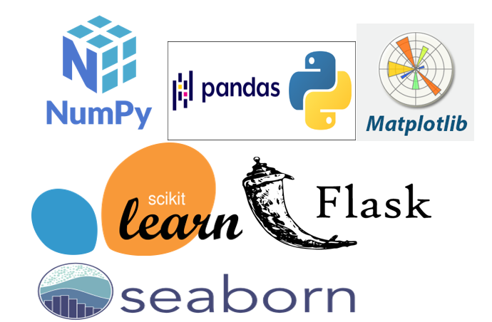

# CreditCard_Default-Prediction


## End To End ML Project

### Created an environment
```
conda create -p venv python==3.8

conda activate venv/
```
### Install all necessary libraries
```
pip install -r requirements.txt
```


### Problem Statement:
```
One of the biggest challenges faced by banks is the risk prediction of credit card clients. The
goal is to predict the probability of credit default based on credit card owner's
characteristics and payment history.
``` 


### Dataset:
```
In the Dataset we have CreditCard holder's characteristics details like Age,Marriage, etc and payment history spanning for 6 months. There is a target variable called default payment next month which is in 1,0 format.
Link: https://archive.ics.uci.edu/dataset/350/default+of+credit+card+clients
```

### Required packages:
```
numpy
pandas
matplotlib
Flask
seaborn
scikit-learn
```


### Steps performed:
```
a. Gather Data
b. Data Preprocessing
c. Split the Data
d. Select a Model
e. Train the Model
f. Evaluate the Model
g. Fine-tune the Model
h. Test the Model
i. Deployment
```